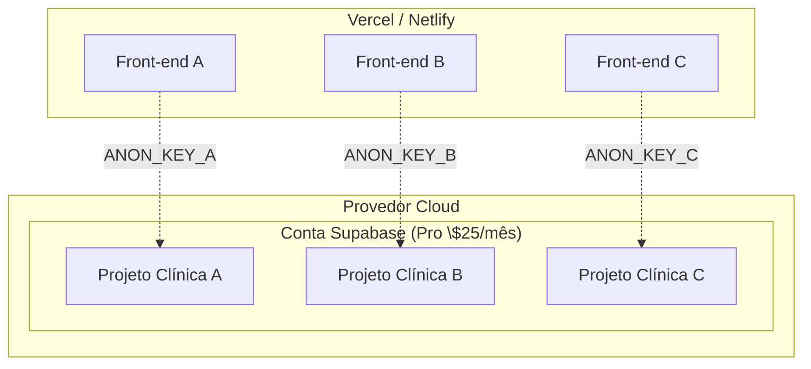
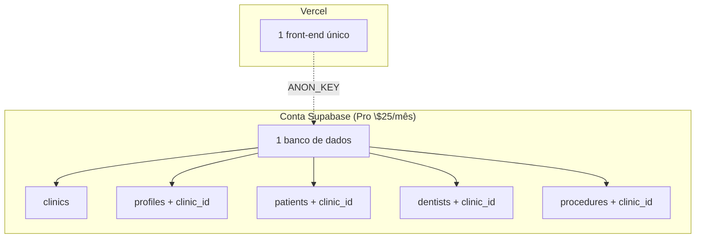

# Análise de Migração — Single-Tenant → Multi-Tenant

> **Data:** Maio/2026
> **Contexto:** AppointDent — sistema de gestão odontológica
> **Stack:** Next.js 16 + Supabase (Auth + PostgreSQL + RLS) + Tailwind CSS v4

---

## Índice

1. [Cenário atual](#1-cenário-atual)
2. [Opções de arquitetura](#2-opções-de-arquitetura)
3. [Comparação lado a lado](#3-comparação-lado-a-lado)
4. [Opção A — Projeto por clínica (recomendada)](#4-opção-a--projeto-por-clínica-recomendada)
5. [Opção B — Multi-tenant verdadeiro (clinic_id)](#5-opção-b--multi-tenant-verdadeiro-clinic_id)
6. [Plano de migração para Opção B](#6-plano-de-migração-para-opção-b)
7. [Server actions — funções afetadas](#7-server-actions--funções-afetadas)
8. [RLS policies — mapeamento completo](#8-rls-policies--mapeamento-completo)
9. [Riscos e trade-offs](#9-riscos-e-trade-offs)
10. [Recomendação](#10-recomendação)

---

## 1. Cenário atual

### Arquitetura (single-tenant)

```
1 projeto Supabase
   └── 1 banco de dados
         ├── profiles       (auth.users vinculado via FK)
         ├── patients       (sem tenant)
         ├── dentists       (profile_id -> profiles)
         ├── procedures     (sem tenant)
         ├── appointments   (patient_id, dentist_id)
         ├── availability_slots
         ├── blocked_slots
         ├── anamnese_sessions
         └── notifications  (user_id -> auth.users)
   └── 1 front-end
```

**Todas as RLS policies atuais** verificam apenas `auth.role() = 'authenticated'` ou `public.get_user_role() IN ('admin', 'dentist')` -- **não há qualquer filtro por clínica/tenant**.

### Schema: helpers e triggers relevantes

- `public.get_user_role()` -- SECURITY DEFINER, retorna a role do profile do usuário atual
- `public.handle_new_user()` -- trigger AFTER INSERT ON auth.users, cria profile com role 'admin'
- Todas as server actions usam `createClient()` (anon key, respeita RLS) -- **nenhuma usa service_role**

### Tabelas e quantidade de RLS policies

| Tabela | Policies | Escopo atual |
|--------|----------|-------------|
| `profiles` | 2 | authenticated pode ler, próprio pode editar |
| `patients` | 4 | authenticated pode tudo |
| `dentists` | 4 | leitura: authenticated; insert/update/delete: admin |
| `procedures` | 4 | leitura: authenticated; insert/update/delete: admin |
| `availability_slots` | 4 | authenticated pode tudo |
| `appointments` | 4 | authenticated pode tudo |
| `blocked_slots` | 4 | leitura: authenticated; insert/update/delete: admin ou dentist |
| `anamnese_sessions` | 4 | leitura: authenticated; insert: admin/dentist; update/delete: próprio dentist ou admin |
| `notifications` | 3 | próprio user (já scoped por user_id) |
| **Total** | **33** | -- |

### Quantidade de código existente

- **7 arquivos** de server actions em `src/lib/actions/`
- **~40 funções exportadas** no total
- **8 tabelas** com dados de negócio
- **33 RLS policies** que precisariam ser modificadas
- **0 referências** a clínica, tenant, organização ou company no código-fonte

---

## 2. Opções de arquitetura

### Opção A -- Projeto por clínica (single-tenant mantido)

Cada clínica ganha **um projeto Supabase próprio + uma instância do front-end**. Nenhuma alteração no código.



### Opção B -- Multi-tenant verdadeiro (clinic_id)

Adiciona uma tabela `clinics` e uma coluna `clinic_id` em todas as tabelas de negócio. RLS policies filtram por `clinic_id`. **Um único banco + um front-end.**



---

## 3. Comparação lado a lado

| Critério | Opção A -- Projeto por clínica | Opção B -- Multi-tenant |
|----------|-------------------------------|------------------------|
| **Alterações no código** | **Nenhuma** ✅ | 1-2 semanas de trabalho |
| **Isolamento de dados** | Total (bancos separados) ✅ | Lógico (RLS + clinic_id) |
| **Risco de vazamento** | Zero (impossível cross-tenant) | Baixo (erro em RLS causa vazamento) |
| **Custo (5 clínicas)** | \$65/mês (Pro + 4 computes extras) | \$25/mês (1 Pro project) |
| **Deployments** | 5 front-ends (1 por clínica) | 1 front-end |
| **Domínios/URLs** | 5 domínios (ou subdomínios) | 1 domínio |
| **Gerenciamento** | 5 projetos Supabase, 5 deploys | 1 projeto, 1 deploy |
| **Cada clínica upgrade** | Independente | Compartilhado (afeta todas) |
| **Onboarding nova clínica** | ~1h manual + deploy | Imediato (via UI) |
| **Backup/restore** | Por projeto (individual) | Único backup (tudo ou nada) |
| **Super admin** | Acesso a todos os projetos Supabase | Dentro da própria app (clinic_id nullable) |

---

## 4. Opção A -- Projeto por clínica (recomendada para até 5 clínicas)

### Fluxo de onboarding (uma vez por clínica)

1. Criar projeto Supabase via dashboard
2. Rodar migrations (`npx supabase db push`)
3. Configurar Auth (redirects, providers)
4. Criar primeiro admin (supabase auth sign-up manual)
5. Configurar variáveis de ambiente no Vercel/Netlify
6. Fazer deploy do front-end

### Custos

| Cenário | Custo/mês | Notas |
|---------|-----------|-------|
| 1 clínica (Free) | \$0 | Pausa após 7 dias inativo |
| 1 clínica (Pro) | \$25 | Compute Micro incluso |
| 3 clínicas (Pro) | \$45 | \$25 + \$10 + \$10 |
| 5 clínicas (Pro) | \$65 | \$25 + \$10 \u00d7 4 |

### Vantagens

- **Zero alterações no código** -- o projeto continua rodando exatamente como está
- **Isolamento total** -- se uma clínica corromper o banco, as outras não são afetadas
- **Cada clínica pode fazer upgrade independentemente** (Free \u2192 Pro quando quiser)
- **Backup/restore independente** por projeto
- **Cada clínica pode ter seu próprio domínio** (clinica1.app.com, clinica2.app.com)

### Desvantagens

- **Gerenciamento manual** de 5 projetos Supabase + 5 deploys
- **Custo mais alto** a partir de 2 clínicas
- **Onboarding mais lento** para nova clínica (~1h de trabalho manual)
- **Sem visão consolidada** dos dados de todas as clínicas em um só lugar

---

## 5. Opção B -- Multi-tenant verdadeiro (clinic_id)

### Modelo de dados proposto

```sql
-- Nova tabela
CREATE TABLE clinics (
  id          UUID PRIMARY KEY DEFAULT uuid_generate_v4(),
  name        TEXT NOT NULL,
  slug        TEXT NOT NULL UNIQUE,
  phone       TEXT,
  email       TEXT,
  active      BOOLEAN NOT NULL DEFAULT TRUE,
  created_at  TIMESTAMPTZ NOT NULL DEFAULT NOW(),
  updated_at  TIMESTAMPTZ NOT NULL DEFAULT NOW()
);

-- Profiles ganha clinic_id (nullable = super admin)
ALTER TABLE profiles
  ADD COLUMN clinic_id UUID REFERENCES clinics(id) ON DELETE SET NULL;

-- Tabelas de negócio ganham clinic_id
ALTER TABLE patients ADD COLUMN clinic_id UUID NOT NULL REFERENCES clinics(id) ON DELETE CASCADE;
ALTER TABLE dentists ADD COLUMN clinic_id UUID NOT NULL REFERENCES clinics(id) ON DELETE CASCADE;
ALTER TABLE procedures ADD COLUMN clinic_id UUID NOT NULL REFERENCES clinics(id) ON DELETE CASCADE;

-- Tabelas que derivam tenant via FK (nao precisam de clinic_id direto)
-- availability_slots  -> tenant via dentist_id -> dentists.clinic_id
-- appointments        -> tenant via dentist_id -> dentists.clinic_id
-- blocked_slots       -> tenant via dentist_id -> dentists.clinic_id
-- anamnese_sessions   -> tenant via dentist_id -> dentists.clinic_id
-- notifications       -> tenant via user_id -> profiles.clinic_id
```

### Função helper nova

```sql
CREATE OR REPLACE FUNCTION public.get_user_clinic_id()
RETURNS UUID
LANGUAGE SQL
STABLE
SECURITY DEFINER SET search_path = ''
AS $$
  SELECT clinic_id FROM public.profiles WHERE id = auth.uid()
$$;
```

### Padrão de RLS (exemplo para pacientes)

```sql
CREATE POLICY "usuarios veem pacientes da propria clinica"
  ON patients FOR SELECT
  USING (
    auth.role() = 'authenticated'
    AND (
      public.get_user_clinic_id() IS NULL
      OR clinic_id = public.get_user_clinic_id()
    )
  );
```

### Impacto em profiles

| Role | clinic_id | O que vê |
|------|-----------|----------|
| Super admin (você) | NULL | Todas as clínicas |
| Admin da clínica | UUID da clínica | Dados da própria clínica |
| Dentist | UUID da clínica | Dados da própria clínica |
| Receptionist | UUID da clínica | Dados da própria clínica |

### Trigger de novo usuário

O trigger `handle_new_user()` precisa ser modificado porque hoje ele cria profiles sem `clinic_id`. No multi-tenant, o fluxo de cadastro precisa:

1. **Convite**: Admin da clínica envia convite -> token com `clinic_id` -> signup inclui `clinic_id` no `raw_user_meta_data`
2. **Primeiro usuário**: Primeiro usuário cria a clínica -> `clinic_id` é associado ao profile
3. **Super admin cria**: Você (super admin) cria a clínica e os usuários dentro dela via dashboard

---

## 6. Plano de migração para Opção B

### Fase 1 -- Schema (4 migrations)

| Migration | Conteúdo | Risco |
|-----------|----------|-------|
| `00008_add_clinics.sql` | CREATE TABLE clinics + policies | Baixo |
| `00009_add_clinic_id_columns.sql` | ALTER TABLE profiles, patients, dentists, procedures ADD clinic_id | **Alto** (NOT NULL em tabelas com dados existentes requer valor padrão ou migração em etapas) |
| `00010_add_helper_and_update_trigger.sql` | Criar `get_user_clinic_id()`, modificar `handle_new_user()` | Médio |
| `00011_rewrite_rls.sql` | Dropar todas as 33 policies antigas, criar novas com filtro clinic_id | **Crítico** (erro aqui abre vazamento) |

### Fase 2 -- Server actions (~7 arquivos, ~40 funções)

Cada server action que faz SELECT/INSERT/UPDATE/DELETE precisa adicionar o filtro `clinic_id`. Padrão geral:

```typescript
// ANTES (single-tenant)
const { data } = await supabase.from("patients").select("*");

// DEPOIS (multi-tenant)
const { data } = await supabase
  .from("patients")
  .select("*")
  .eq("clinic_id", user.clinic_id);
```

**Estimativa por arquivo:**

| Arquivo | Funções | Complexidade | Esforço estimado |
|---------|---------|--------------|------------------|
| `appointments.ts` | 7 | Média (deriva clinic_id do dentista ou paciente) | 4h |
| `patients.ts` | 5 | Baixa (filtro direto por clinic_id) | 2h |
| `dentists.ts` | 4 | Baixa (filtro direto por clinic_id) | 2h |
| `procedures.ts` | 4 | Baixa (filtro direto por clinic_id) | 2h |
| `availability-slots.ts` | 4 | Média (deriva via dentist_id) | 2h |
| `notifications.ts` | 5 | Baixa (já scoped por user_id) | 1h |
| `anamnese.ts` | 11 | Alta (deriva via dentist_id, lida com múltiplas tabelas) | 6h |

**Total estimado: ~19 horas** (3 dias úteis)

### Fase 3 -- Auth e onboarding

- Criar página/flow de criação de clínica (primeiro admin da clínica)
- Ou criar dashboard de super admin para gerenciar clínicas
- Implementar convite por email (opcional)
- Modificar `handle_new_user()` ou criar função `invite_user_to_clinic()`

**Esforço estimado: 2-3 dias**

### Fase 4 -- UI components

- Sidebar: mostrar nome da clínica atual
- Header: seletor de clínica (para super admin)
- Dashboard: filtrar cards por clínica
- Páginas de listagem: adicionar filtro de clínica (para super admin)
- Página de administração de clínicas (CRUD)

**Esforço estimado: 2-3 dias**

### Cronograma total (Opção B)

| Fase | Esforço | Pode paralelizar? |
|------|---------|-------------------|
| Migrations SQL | 1 dia | Não (sequencial) |
| Server actions | 3 dias | Sim (por arquivo) |
| Auth/onboarding | 2-3 dias | Parcial |
| UI components | 2-3 dias | Sim |
| Testes + validação | 1-2 dias | Não |
| **Total** | **~10-15 dias úteis** | **2-3 semanas corridas** |

---

## 7. Server actions -- funções afetadas

### `appointments.ts` (7 funções)

| Função | Como adicionar clinic_id |
|--------|--------------------------|
| `getAppointments` | Filtro via join com `dentists.clinic_id` |
| `getAppointmentsRange` | Mesmo |
| `searchAppointmentsForReturn` | Mesmo |
| `createAppointment` | Validar `dentist.clinic_id` do usuário atual corresponde ao dentista |
| `updateAppointment` | Verificar clinic_id antes de atualizar |
| `updateAppointmentStatus` | Verificar clinic_id |
| `deleteAppointment` | Verificar clinic_id |

### `patients.ts` (5 funções)

| Função | Como adicionar clinic_id |
|--------|--------------------------|
| `getPatients` | `.eq("clinic_id", userClinicId)` |
| `createPatient` | Incluir `clinic_id` no INSERT |
| `quickCreatePatient` | Incluir `clinic_id` no INSERT |
| `updatePatient` | Checar `clinic_id` antes do UPDATE |
| `deletePatient` | Checar `clinic_id` antes do DELETE |

### `dentists.ts` (4 funções)

| Função | Como adicionar clinic_id |
|--------|--------------------------|
| `getDentists` | `.eq("clinic_id", userClinicId)` |
| `createDentist` | Incluir `clinic_id` no INSERT |
| `updateDentist` | Checar `clinic_id` |
| `deleteDentist` | Checar `clinic_id` |

### `procedures.ts` (4 funções) -- mesmo padrão

### `availability-slots.ts` (4 funções)

| Função | Como adicionar clinic_id |
|--------|--------------------------|
| `getAvailabilitySlots` | Derivado via join `dentists.clinic_id` |
| `createAvailabilitySlot` | Validar `dentist.clinic_id` do slot |
| `updateAvailabilitySlot` | Validar |
| `deleteAvailabilitySlot` | Validar |

### `notifications.ts` (5 funções) -- já scoped por `user_id` e `auth.uid()`, **nenhuma alteração necessária**

### `anamnese.ts` (11 funções)

A mais complexa: lida com `anamnese_sessions`, `appointments`, `patients`, `dentists`. Cada função precisa verificar `clinic_id` na tabela relevante -- geralmente derivado via `dentist_id` ou `patient_id`.

---

## 8. RLS policies -- mapeamento completo

### Policies que precisam de alteração (33)

| # | Tabela | Policy atual | Tipo | Mudança necessária |
|---|--------|-------------|------|-------------------|
| 1 | profiles | anyone can read profiles | SELECT | Adicionar: mesma clínica OU clinic_id IS NULL (super admin) |
| 2 | profiles | users can update their own profile | UPDATE | Manter (já scoped por auth.uid()) |
| 3 | patients | anyone can read patients | SELECT | Adicionar clinic_id = get_user_clinic_id() |
| 4 | patients | anyone can insert patients | INSERT | Adicionar clinic_id = get_user_clinic_id() |
| 5 | patients | anyone can update patients | UPDATE | Adicionar clinic_id = get_user_clinic_id() |
| 6 | patients | anyone can delete patients | DELETE | Adicionar clinic_id = get_user_clinic_id() |
| 7 | dentists | anyone can read dentists | SELECT | Adicionar clinic_id = get_user_clinic_id() |
| 8 | dentists | admin can insert dentists | INSERT | Adicionar clinic_id = get_user_clinic_id() |
| 9 | dentists | admin can update dentists | UPDATE | Adicionar clinic_id = get_user_clinic_id() |
| 10 | dentists | admin can delete dentists | DELETE | Adicionar clinic_id = get_user_clinic_id() |
| 11 | procedures | anyone can read procedures | SELECT | Adicionar clinic_id = get_user_clinic_id() |
| 12 | procedures | admin can insert procedures | INSERT | Adicionar clinic_id = get_user_clinic_id() |
| 13 | procedures | admin can update procedures | UPDATE | Adicionar clinic_id = get_user_clinic_id() |
| 14 | procedures | admin can delete procedures | DELETE | Adicionar clinic_id = get_user_clinic_id() |
| 15 | availability_slots | anyone can read availability slots | SELECT | EXISTS (SELECT 1 FROM dentists WHERE id = dentist_id AND clinic_id = get_user_clinic_id()) |
| 16 | availability_slots | anyone can insert availability slots | INSERT | Mesmo check |
| 17 | availability_slots | anyone can update availability slots | UPDATE | Mesmo check |
| 18 | availability_slots | anyone can delete availability slots | DELETE | Mesmo check |
| 19 | appointments | anyone can read appointments | SELECT | EXISTS (SELECT 1 FROM dentists WHERE id = dentist_id AND clinic_id = get_user_clinic_id()) |
| 20 | appointments | anyone can insert appointments | INSERT | Mesmo check |
| 21 | appointments | anyone can update appointments | UPDATE | Mesmo check |
| 22 | appointments | anyone can delete appointments | DELETE | Mesmo check |
| 23 | blocked_slots | anyone can read blocked slots | SELECT | EXISTS (SELECT 1 FROM dentists WHERE id = dentist_id AND clinic_id = get_user_clinic_id()) |
| 24 | blocked_slots | admin or dentist can insert blocked slots | INSERT | Mesmo check |
| 25 | blocked_slots | admin or dentist can update blocked slots | UPDATE | Mesmo check |
| 26 | blocked_slots | admin or dentist can delete blocked slots | DELETE | Mesmo check |
| 27 | anamnese_sessions | Todos podem ler | SELECT | EXISTS (SELECT 1 FROM dentists WHERE id = dentist_id AND clinic_id = get_user_clinic_id()) |
| 28 | anamnese_sessions | Dentistas e admins podem inserir | INSERT | Mesmo check |
| 29 | anamnese_sessions | Dentistas atualizam próprias, admins todas | UPDATE | Mesmo check |
| 30 | anamnese_sessions | Dentistas deletam próprias, admins todas | DELETE | Mesmo check |
| 31 | notifications | users can read their own notifications | SELECT | Manter |
| 32 | notifications | system can insert notifications | INSERT | Manter |
| 33 | notifications | users can update their own notifications | UPDATE | Manter |

**Total a modificar: 30 policies** (3 de notifications já estão corretas)

---

## 9. Riscos e trade-offs

### Opção A -- Projeto por clínica

**Riscos:**

- Gerenciar 5 projetos + 5 deploys manualmente é trabalhoso
- Se uma clínica quiser um domínio personalizado, precisa configurar SSL/DNS para cada deploy
- Sem visão consolidada dos dados (precisa acessar cada projeto individualmente)
- Custo fixo de ~$13/clínica/mês (com 5 clínicas)

**Mitigação:**

- Script de automação para criar projeto + deploy (já existe esboço em `guia-deploy-single-tenant.md`)
- Terraform ou Pulumi para infraestrutura como código (overkill para 5 projetos)
- Dashboard super admin separado (conecta em múltiplos projetos Supabase via service_role)

### Opção B -- Multi-tenant

**Riscos:**

- Vazamento de dados entre clínicas se RLS estiver incorreta (risco reputacional)
- 2-3 semanas de desenvolvimento parando outras entregas
- Bug em uma migration afeta todas as clínicas simultaneamente
- Se o banco crescer além do plano, upgrade afeta todas as clínicas
- Complexidade de auth aumenta (convites, clínica no signup)

**Mitigação:**

- Testes de RLS obrigatórios (criar user de clínica A, tentar acessar dado de B)
- Pipeline de CI com testes de integração multi-tenant
- Migration todas testadas em staging antes de produção
- clinic_id como UUID não serial (impossível adivinhar)

---

## 10. Recomendação

### Para 5 clínicas pequenas (~100 pacientes, ~8 dentistas cada)

**Cenário ideal é um híbrido:**

#### Fase 1 (imediato) -- Manter single-tenant

Enquanto o sistema está em desenvolvimento e só tem 1-2 clínicas de teste, manter o single-tenant. **Zero investimento em multi-tenant agora.**

#### Fase 2 (quando chegar na 3ª clínica) -- Migrar para multi-tenant

Quando houver 3+ clínicas, o custo de gerenciar deploys separados começa a superar o custo de desenvolvimento. Nesse ponto:

1. Aplicar as 4 migrations
2. Re-escrever as 30 RLS policies
3. Modificar as ~40 funções das server actions
4. Atualizar o mínimo auth flow (criação de clínica)
5. Deploy único

#### Por que não fazer agora?

- O sistema ainda está em construção (MVP ~80%)
- Multi-tenant adiciona complexidade em cada nova funcionalidade
- Você não tem 5 clínicas hoje -- não vale o investimento de 2-3 semanas
- Quando chegar a 3ª clínica, você terá mais clareza sobre o modelo de negócio

#### E se começar com Opção A e depois quiser migrar para Opção B?

É factível. Como a Opção A não modifica o código, você pode:

1. Pegar o schema de uma clínica
2. Adicionar as migrations de multi-tenant
3. Migrar os dados de cada projeto para o novo schema unificado
4. Trocar o front-end para apontar para o novo projeto

O script de migração de dados seria algo como:

```sql
-- Para cada projeto de clínica:
INSERT INTO public.clinics (id, name, slug)
VALUES ('uuid-fixo-da-clinica', 'Nome da Clínica', 'clinica-x');

UPDATE patients SET clinic_id = 'uuid-fixo-da-clinica';
UPDATE dentists SET clinic_id = 'uuid-fixo-da-clinica';
UPDATE procedures SET clinic_id = 'uuid-fixo-da-clinica';
UPDATE profiles SET clinic_id = 'uuid-fixo-da-clinica';
```

### Resumo

| Situação | Recomendação |
|----------|-------------|
| 1-2 clínicas hoje | Manter single-tenant (Opção A) |
| 3-5 clínicas em 3 meses | Migrar para multi-tenant (Opção B) |
| 5+ clínicas | Multi-tenant ou projeto-por-clínica com automação |
